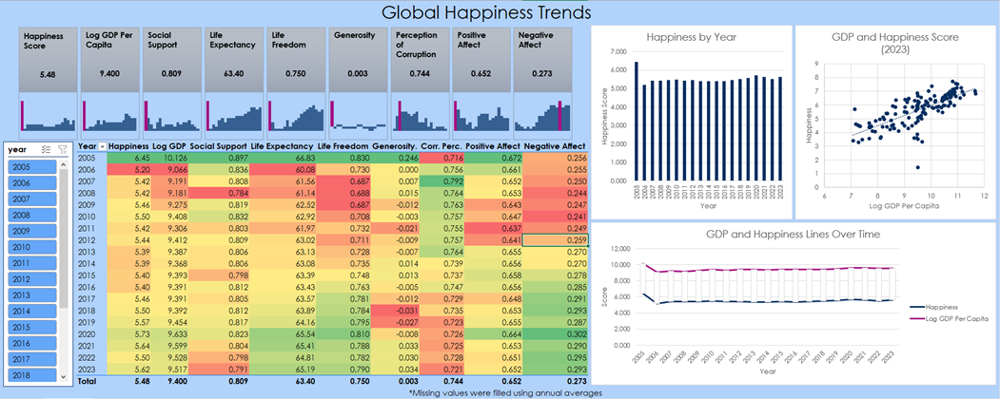

# Global Happiness Trends Dashboard

📊 An Excel-based dashboard that explores global happiness trends from 2005 to 2023 using GDP, social support, freedom, life expectancy, and more.

## 🔧 Tools Used
- Microsoft Excel (Pivot Tables, Heatmaps, Line Charts, Sparklines, Conditional Formatting)
- Formulas: `AVERAGEIFS`

## 🧹 Data Cleaning & Preparation
- Identified and filled blank values using `AVERAGEIFS` to calculate country-specific averages over time
- Standardized column formats and trimmed whitespace

## 📈 Key Features
- Trend analysis of happiness score over time
- Visual correlation between GDP and happiness
- Excel sparklines for quick trend previews in rows
- Dynamic charts and summary statistics using pivot tables

## 📁 Files
- [`happiness_proj.xlsx`](./happiness_proj.xlsx): Main Excel file with visual dashboard
- 

## 🌍 Insights
- Happiness peaked in 2005 and dipped in 2006
- GDP per capita strongly correlates with happiness
- Perceived freedom and social support vary by region and year

## 📊 Data Source
Original dataset from Kaggle:  
[World Happiness Report – 2024](https://www.kaggle.com/datasets/jainaru/world-happiness-report-2024-yearly-updated?select=World-happiness-report-updated_2024.csv)

Data includes happiness scores, GDP per capita, social support, and other indicators by country and year.

## 🔗 Project Link
[View on GitHub](https://github.com/aaronthai2/global-happiness-analysis)
